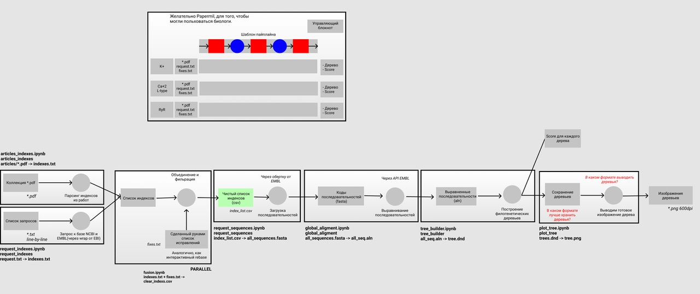

   # urfu_bioinf_2020
Pipeline for building of phylogenetic trees

## Description
Using this pipeline you can create amazing phylogenetic trees of 
cell's channel. It's quite simple, you just need to add NCBI's indexes of 
genes or articles in the format html. At the output of the pipeline you 
can receive pictures with your phylogenetic trees. 
Pipeline can be configured for any phylogenetic tree creation.  

The pipeline structure is here:

## Denpendences
* Snakemake
* Matplotlib
* Biopython
* ClustalW
*  R
*  ggtree

## Installation

You may use **Docker** but if you **don't want to do it**, make sure that you use R  which is **3.6** version or later.
Clone this repository to your workflow
```sh
git clone git@github.com:KonstantinUshenin/urfu_bioinf_2020.git
```

In the directory of this repository execute command for install
dependencies for Python
```sh
pip install requirements.txt
```
After that compile libraries for R:
```sh
make
```

## Usage

1. Make dir in folder `dataset` with name of your channel

2. In channel's directory add file with name `request.txt` and folder 
with name `article/`. In file `request.txt` add NCBI's indexes of nucleotides
and add to folder `article/` articles you are interested in

3.  That's all. You can run pipeline by execute command


```sh
snakemake --cores=1 --forceall
```

## Project structure

There are various folders in the project's directory:
* **dataset** - contains folders with Ca and Na channels, which you may use as an example, here you can add your own channels
* **notebook_template** - contains .py and .ipynb files which are neccessary for aligning sequences, building trees and visualization progress
* **pkg-source-files** - contains packages for proper working with R
* **utils** - contains commands for installing R dependencies and other utilites
* **workflow** - a folder, which contains a result of a pipeline's work
In the root directory you may see **Snakefile** and **Dockerfile** which you need to run in order to see the results of a pipeline.
